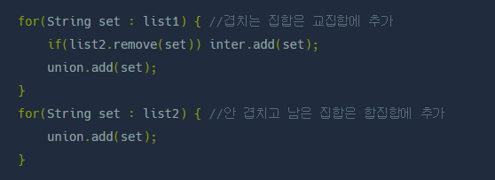

## 비밀지도

```
https://school.programmers.co.kr/learn/courses/30/lessons/17681
```

비트 연산자가 이 문제의 핵심이었던 것 같다.
```
비트 연산자를 사용하면 문제를 쉽게 풀 수 있다.
- | : or 연산자
  - 두 비트 중 하나라도 1일 경우 연산 결과가 1로 표현됨
- & : and 연산자
  - 두 비트 중 하나라도 0일 경우 연산 결과가 0으로 표현됨
- ^ : xor 연산자
  - 두 비트가 같으면 0 다르면 1로 표현됨
- ~ : 비트 전환 연산자
  - 0은 1로 1은 0으로 변경
- x << y : 쉬프트 연산자
  - x의 각 비트를 y만큼 왼쪽으로 이동시킨다. (빈자리는 0으로 채워짐)
- x >> y : 쉬프트 연산자
  - -x의 각 비트를 y만큼 오른쪽으로 이동시킨다. (빈자리는 최상위 부호비트와 같은 값으로 채워짐)
- x >>> y : 쉬프트 연산자
  - 정수 x의 각 비트를 y만큼 오른쪽으로 이동시킨다. (빈자리는 0으로 채워짐)
```

비트 연산자 참고 블로그
```
https://staticclass.tistory.com/25 참고
```

### 나의 풀이 방법
```
1. 이진수로 변환해서 서로 더함
2. 최상위 자리가 0인경우에는 값이 없기 떄문에 그만큼 공백으로 대체
3. 값이 0 이면 공백으로, 값이 1이면 #으로 치환 (replaceAll을 사용했으면 더 좋았을 것..)
```


### 다른사람 풀이 방법

```
1. 비트 연산자 + % n s 를 사용하였다 (이런 문법이 가능한 줄 몰랐다.)
2. replaceAll
3. 추가 : %ns로 사용할 경우에 속도가 느리다고 한다. 풀이 방법 2가 조금 더 빠른 속도를 가지고 있는 듯하다.
```

```
### 다른 사람 풀이 방법 2
1. 첫번째 풀이 방법과 다른 부분은 %16s로 고정하고, subString을 사용하는 것이다.
2. 훨씬 빠른 속도를 가지고 있다고 함.
```


<br/><br/>

---
## 다트 게임
```
https://school.programmers.co.kr/learn/courses/30/lessons/17682
```

이 문제는 내가 arraylist를 사용하여서 문제를 많이 복잡하게 풀기도 하였고,
그냥 글자를 for문으로 내려서 풀어도 됐는데, 괜히 리스트로 나눈 다음에 진행하여 코드가 많이 길어졌다.
풀이 방법은 스택을 사용하면 아래와 같이 간단하게 풀 수 있다.


<br/><br/>

---
## 방금그곡
```
https://school.programmers.co.kr/learn/courses/30/lessons/17683
```

실수만 안하면 금방 풀 수 있는 문제
replaceAll 사용하는 것이 관건


<br/><br/>

---
## 파일명 정렬
```
https://school.programmers.co.kr/learn/courses/30/lessons/17686
```
파일명을 분리하는 작업과 정렬하는 작업을 나눠서 진행하여 코드가 길어짐
다른 사람들은 정규 표현식을 이용해서 파일명 분리와 동시에 정렬을 진행하여 코드가 깔끔한 것을 확인할 수 있다.

### 나의 풀이 방법


### 다른사람 풀이 방법

```
1. 정규 표현식으로 파일명을 분리
2. 분리한 것을 바탕으로 정렬
```


<br/><br/>

---
## [3차] 압축
```
https://school.programmers.co.kr/learn/courses/30/lessons/17684
```

알파벳을 map에 넣는 방법을 수작업으로 진행했었는데 아래와 같이 진행했으면 더 좋았을 것 같음

`todo: 이 문제에서, 다른 사람의 코드를 조금 더 참고하면 좋을 것 같음, 아직은 참고할 만한 코드가 안보임`


<br/><br/>

---
## [1차] 캐시

```
문제 설명
캐시에 대한 문제임 (LRU : Least Recently Used)
캐시 사이즈만큼 캐시 데이터를 저장할 수 있음.
캐시에 데이터가 저장되어 있는 경우 (Hit) : 시간 +=1
캐시에 데이터가 저장되어 있지 않은 경우 (Miss) : 시간 += 5
총 걸리는 시간 구하기
```

### 나의 문제 풀이 방법
처음에는 Map을 이용하여 문제를 풀어보려고 하였음.
Map이 List보다 데이터 접근 삭제에서 더 빠른 속도를 얻을 수 있기 떄문이다.
Map에 데이터가 없는 경우에는 데이터를 넣고 value에 시간을 저장
Map에 데이터가 있는 경우에는 시간 +1 데이터의 value 시간을 초기화
나머지는 시간 -= 1 으로 풀어나가려고 헀으나 아래 케이스인 경우 문제가 발생하였다.

cacheSize 3
C, A, A, B인 케이스에서 문제가 발생

C: (C 3)
A: (C 2) (A 3)

-> 잘못된 나의 로직
A: (C 1) (A 3)
-> 정상 로직
A: (C 2) (A 3)

Linked list로 문제를 풀었음
 


### 다른 사람 문제 풀이 
```aidl
todo 다른 사람 문제 풀이 이해할 것
linked hashmap에 대한 이해 필요
```

linked hashmap을 이용하여 문제를 풀었음


<br/><br/>

---
## [1차] 프렌즈블록
```
todo 다른 사람의 코드를 살펴봐야함
```

```
문제 설명
애니팡 같은 문제다.
2X2 셀이 모두 같은 모양의 블럭이라면 파괴되면서 점수가 올라가는 상태다.
초기 블럭이 주어졌을 때, 같은 모양의 블럭이 파괴되고 -> 파괴된 블럭이 내려오고 -> 다시 파괴 될 수 있다면 또 파괴하고
위 사이클을 거쳤을 때 최종 점수를 계산하는 문제다. 
```

그냥 단순하게 풀었다.
더 잘 풀 수 있는 방법이 있는지 참고하면 좋을 것 같다.


<br/><br/>

---
## [1차] 뉴스 클러스터링

```
문제 설명 (News17677.java)
유사한 기사를 묶는 기준에 '자카드 유사도' 라는 방법이 있다. 이에 대한 문제이다.

집합간의 유사도를 검사로 계산 방법은 교집합의 크기를 두 집합의 합집합의 크기로 나누는 것이다.
두 집합 모두 공집합일 경우 1로 계산한다.
다중집합 교집합 = min 합집합 = max로 계산
```

```a
실패원인 
```
1. getMap 메서드에서 문자열만 count를 하기 위해 matches를 하였는데 pattern을 잘못 설정함
2. 다른 사람들의 코드를 보면 합집합, 교집합을 구하는 부분이 조금 더 간결함


```
다른 사람의 문제 풀이1
stream을 잘 사용 함
```


```
다른사람 문제 풀이2
```

matches는 아래와 같이 사용하면 됨


교집합과 합집합은 아래와 같이 




추석트래픽 (다시풀어봐야함)
Traffic_17676

셔틀버스 (다시풀어봐야함)
Shuttle_17678
priorityqueue

AutoComplete_17685
남의것도 좀 보기
